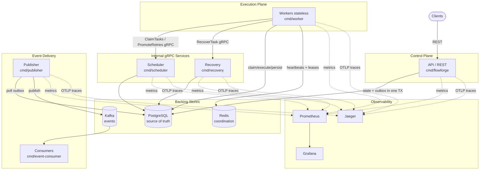

# System Architecture

This document describes FlowForge's architecture as implemented. The code is the
source of truth; discrepancies discovered during the audit are called out
explicitly.

## 1. Overview

FlowForge is a distributed DAG workflow engine composed of independent,
horizontally scalable processes coordinating through three backing stores:

| Store | Ownership | Rationale |
|---|---|---|
| **PostgreSQL** | Durable workflow/task state + transactional outbox | Single source of truth; ACID transitions; `FOR UPDATE SKIP LOCKED` claiming |
| **Redis** | Ephemeral coordination: worker heartbeats, task leases | Fast TTL-based liveness; correctness does not depend on it |
| **Kafka** | Asynchronous event stream (workflow lifecycle) | Decoupled, at-least-once fan-out to consumers |

## 2. Processes

| Process | Binary | Serves | Depends on | Executes tasks? |
|---|---|---|---|---|
| API / control plane | `flowforge` | HTTP `:8080`, metrics `:9091`, embedded gRPC health | PostgreSQL | No |
| Scheduler | `scheduler` | gRPC `:9090`, metrics | PostgreSQL | No |
| Recovery | `recovery` | gRPC `:9090`, metrics | PostgreSQL | No |
| Worker | `worker` | metrics only | PostgreSQL, Redis, (opt.) gRPC scheduler/recovery | **Yes** |
| Publisher | `publisher` | metrics only | PostgreSQL, Kafka | No (never mutates state) |
| Event consumer | `event-consumer` | metrics only | Kafka | No (reference consumer) |

> **Deployment flexibility.** Workers use *local* in-process scheduler/recovery
> clients by default. Setting `SCHEDULER_ADDR` / `RECOVERY_ADDR` switches them to
> the standalone gRPC services (as Docker Compose does). This lets FlowForge run
> as a modular monolith or as microservices from the same codebase.

## 3. Overall System Diagram



See also the ASCII rendering in [diagrams/system.md](diagrams/system.md).

## 4. Ownership Boundaries (validated)

These invariants are enforced by the implementation:

| Boundary | Owner | Evidence |
|---|---|---|
| External APIs | REST (`internal/api`) | Only `internal/api/server.go` registers HTTP routes |
| Synchronous internal comms | gRPC (`internal/{scheduler,recovery,grpcutil}`) | `SchedulerService`, `RecoveryService`, `HealthService` |
| Asynchronous events | Kafka (`internal/outbox`) | Publisher writes to Kafka only |
| Ephemeral coordination | Redis (`internal/worker` coordinator) | Heartbeats + leases; TTL keys |
| Durable state | PostgreSQL (`internal/repository`) | All SQL centralized in repository |
| Stateless execution | Workers | No persisted worker state; identity is ephemeral |
| Publisher isolation | Publisher | Reads outbox + marks published; **never** writes workflow/task state |
| Scheduler/Recovery isolation | Scheduler, Recovery | Claim/promote/reclaim only; **never** execute task logic |

## 5. Domain Model & State Machines

### Tables (PostgreSQL — `schema.sql`)

| Table | Purpose |
|---|---|
| `workflow_definitions` | Workflow blueprints |
| `task_definitions` | Task specs (type, config, retries, timeout, priority) |
| `task_dependencies` | DAG edges between task definitions |
| `workflow_runs` | Run state + `event_sequence` counter |
| `task_runs` | Per-run task state + `fencing_token` |
| `task_attempts` | Per-attempt execution history |
| `dead_letter_tasks` | Terminal failures (DLQ) |
| `outbox_events` | Transactional outbox rows → Kafka |

### Workflow run status

`PENDING → RUNNING → COMPLETED | FAILED | CANCELLED`

### Task run status

```
PENDING ──(deps satisfied)──► READY ──(claim)──► CLAIMED ──(start)──► RUNNING
                                                                    │
        ┌───────────────────────────────────────────────┬─────────┤
        ▼                         ▼                       ▼         ▼
    COMPLETED                RETRY_WAIT               TIMED_OUT   FAILED
        │                (backoff, then promote                    │
   unlocks children       to READY)                         (retries left → RETRY_WAIT;
                                                             exhausted → DLQ + FAILED)
```

`SKIPPED` is used when a dependency fails and downstream tasks cannot run.

### Fencing tokens

Every claim increments `task_runs.fencing_token`. State-changing operations
(`StartTaskRun`, `MarkTaskRunCompleted`, `MarkTaskRunFailed`) and recovery are
guarded by the token, so a resurrected or slow worker cannot mutate a task that
has since been reclaimed. Combined with idempotent executors, this gives
effectively-once execution: a task may be *attempted* more than once, but only
one attempt can commit its result.

## 6. Concurrency & Coordination

- **Claiming:** `ClaimReadyTasksBatch` selects `READY` tasks ordered by
  `priority DESC, created_at ASC` using `FOR UPDATE OF ... SKIP LOCKED`, so many
  workers claim disjoint batches without blocking.
- **Backpressure:** each worker computes
  `available_slots = poolSize − active − queued` and claims at most
  `min(available_slots, batchSize)`; when saturated, claiming pauses.
- **Leases:** Redis keys `flowforge:task:<id>:lease` (TTL `TASK_LEASE_TTL_MS`),
  renewed every `TASK_LEASE_RENEW_INTERVAL_MS` via a same-owner Lua script. Lease
  loss cancels the task's execution context.
- **Heartbeats:** Redis keys `flowforge:worker:<id>:heartbeat` prove worker
  liveness to the recovery loop.

## 7. Failure Handling & Recovery

- **Retries:** `MarkTaskRunFailed` schedules `RETRY_WAIT` with exponential
  backoff (capped at 1h); `PromoteDueRetries` returns them to `READY`.
- **Dead letter:** on retry exhaustion, a `dead_letter_tasks` row is inserted and
  the workflow transitions to `FAILED`.
- **Crash recovery:** the recovery service (and the worker's recovery loop)
  detects stale `CLAIMED`/`RUNNING` tasks whose lease owner is no longer alive
  and reclaims them (`RecoverClaimedTask`/`RecoverRunningTask`), marking the
  orphaned attempt `ORPHANED` (failure type `WORKER_LOST`) and resetting the task
  to `READY`. Guarded by fencing token.

See [diagrams/recovery.md](diagrams/recovery.md) for the recovery flow.

## 8. Event Delivery (Transactional Outbox)

1. A state transition and its event row are written in **one** DB transaction
   (`insertOutboxEventTx`), using an atomic per-run `sequence` for ordering.
2. The `publisher` claims pending rows (`FOR UPDATE SKIP LOCKED`, leased by
   `locked_by`/`locked_until`), publishes to Kafka keyed by `workflow_run_id`
   (`RequireAll` acks), then marks them published.
3. A crash between Kafka ack and mark yields a duplicate delivery — tolerated by
   idempotent consumers. Published rows are pruned after `OUTBOX_RETENTION`.

This gives **at-least-once** delivery with **per-workflow ordering** and no lost
events even if Kafka is down at write time.

## 9. Observability Architecture

- **Metrics:** OpenTelemetry meter → Prometheus exporter, exposed at `/metrics`
  on every process (`METRICS_ADDR`). Instruments cover HTTP, gRPC, worker
  (queue depth, task lifecycle counters), and outbox counters.
- **Tracing:** OTLP/gRPC batch exporter → Jaeger when `OTEL_DISABLED=false`;
  no-op otherwise. W3C TraceContext propagates across HTTP, gRPC, and Kafka
  headers.
- **Logging:** Zap JSON with a `service` field and correlation IDs.

## 10. Known Architectural Notes

- **Mixed route prefixes.** `POST /runs` and `GET /runs/{id}` lack the
  `/api/v1/` prefix used by the newer endpoints. See [api.md](api.md).
- **`GET /runs/{id}` returns 500 (not 404) on missing rows**, unlike the history
  and attempts endpoints which map `sql.ErrNoRows → 404`. See [api.md](api.md).
- **Some worker timing knobs** (`WORKER_POLL_INTERVAL`, `CLAIMED_STALE_TIMEOUT`,
  `RUNNING_STALE_TIMEOUT`, `RECOVERY_INTERVAL`) are parsed in `cmd/worker/main.go`
  rather than in `internal/config`.
- **No authentication** on the REST API — intended to sit behind an auth
  proxy/gateway.
