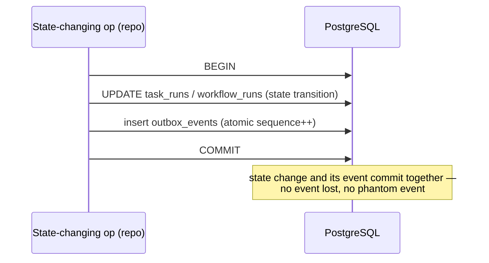

# Event Flow (Transactional Outbox → Kafka)

FlowForge never writes to Kafka inside a request. Doing so would risk the
classic dual-write problem: the database commit succeeds but the Kafka write
fails (or vice versa), leaving state and events out of sync.

Instead it uses the **transactional outbox** pattern. State changes and their
events are written in the *same* database transaction, and a separate publisher
relays them to Kafka afterwards, at-least-once.

## Writing the event (atomic with state)



## Publishing to Kafka

The publisher polls the outbox, claims a batch with `FOR UPDATE SKIP LOCKED`
(so multiple publishers can run), and produces to Kafka keyed by
`workflow_run_id` for per-workflow ordering. Consumers must be idempotent
because delivery is at-least-once.

```mermaid
sequenceDiagram
  participant Pub as Publisher
  participant DB as PostgreSQL
  participant K as Kafka

  loop every OUTBOX_POLL_INTERVAL
    Pub->>DB: ClaimPendingOutboxEvents (FOR UPDATE SKIP LOCKED; lease)
    DB-->>Pub: []OutboxEvent
    loop each event
      Pub->>K: Produce(key=workflow_run_id, value, trace headers) [RequireAll]
      alt ack
        Pub->>DB: MarkOutboxPublished
      else error
        Pub->>DB: RecordOutboxError (reschedule with backoff)
      end
    end
  end
```

Consumers dedupe by event ID and commit offsets only after processing, so a
redelivered event is a no-op.
