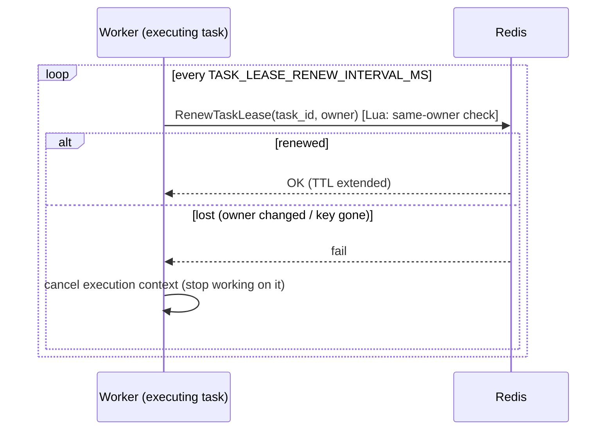

# Crash Recovery

Retries handle tasks that *fail*. Recovery handles tasks whose *worker
disappears* mid-execution — a crash, a network partition, or a hung process.
Without recovery, such a task would sit in `CLAIMED`/`RUNNING` forever.

## Lease renewal (liveness)

While executing, a worker renews its Redis lease. The renewal is a Lua script
that checks the lease is still owned by the same worker before extending it. If
renewal fails (the lease expired or was taken over), the worker cancels its own
execution context rather than risk a double-write.



## Reclaiming stale tasks

A recovery loop periodically scans for tasks that are `CLAIMED`/`RUNNING` past
their timeout. If the lease owner is no longer alive, the task is reclaimed and
reset to `READY`. The reclaim is guarded by the fencing token, so if the
original worker comes back it cannot complete a task that has moved on.

```mermaid
sequenceDiagram
  participant RL as Recovery loop
  participant R as Redis
  participant Rec as RecoveryService
  participant DB as PostgreSQL

  loop every RECOVERY_INTERVAL
    RL->>DB: GetActiveTaskRuns (CLAIMED/RUNNING)
    loop each stale task (age > stale timeout)
      RL->>R: lease owner still alive?
      alt no live lease owner
        RL->>Rec: RecoverTask(task_run_id, fencing_token, status)
        Rec->>DB: RecoverClaimedTask / RecoverRunningTask (guarded by fencing_token)
        note over DB: attempt -> ORPHANED (WORKER_LOST);<br/>task -> READY; emit TaskRecovered
      else owner alive
        RL->>RL: skip
      end
    end
    RL->>DB: PromoteRetries
  end
```

**Why fencing tokens matter:** every claim increments a monotonic token. A
worker that was presumed dead but wakes up still holds the *old* token; its
guarded writes no-op because the token no longer matches. This is what makes
recovery safe against the "zombie worker" problem.
