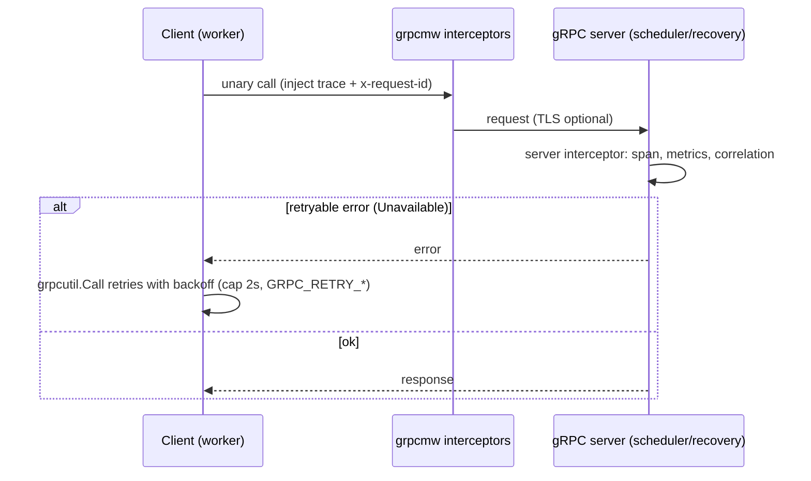

# Sequence Diagrams

Sequence diagrams for FlowForge's core flows, reflecting the implementation.
Mermaid renders on GitHub.

- [Workflow Creation](#1-workflow-creation)
- [Task Scheduling](#2-task-scheduling)
- [Task Execution](#3-task-execution)
- [Retry](#4-retry)
- [Lease Renewal](#5-lease-renewal)
- [Worker Crash Recovery](#6-worker-crash-recovery)
- [DLQ Flow](#7-dlq-flow)
- [Transactional Outbox](#8-transactional-outbox)
- [Kafka Publication](#9-kafka-publication)
- [gRPC Communication](#10-grpc-communication)
- [System Startup](#11-system-startup)
- [Graceful Shutdown](#12-graceful-shutdown)

---

## 1. Workflow Creation

```mermaid
sequenceDiagram
  participant C as Client
  participant API
  participant DAG as dag.Validate
  participant DB as PostgreSQL

  C->>API: POST /api/v1/workflows
  API->>DAG: Validate(definition)
  alt invalid DAG (cycle / dup / missing dep)
    DAG-->>API: error
    API-->>C: 422 Unprocessable Entity
  else valid
    API->>DB: CreateWorkflowDefinition (TX: def + tasks + deps)
    DB-->>API: WorkflowDefinition
    API-->>C: 201 Created
  end

  C->>API: POST /runs {workflow_definition_id, input}
  API->>DB: CreateWorkflowRun (TX)
  note over DB: root tasks -> READY; others -> PENDING;<br/>emit WorkflowStarted to outbox
  DB-->>API: WorkflowRun (PENDING)
  API-->>C: 201 Created
```

## 2. Task Scheduling

```mermaid
sequenceDiagram
  participant W as Worker
  participant S as Scheduler (local or gRPC)
  participant DB as PostgreSQL

  loop poll (WORKER_POLL_INTERVAL)
    W->>W: available = pool - active - queued
    alt available > 0
      W->>S: ClaimTasks(worker_id, capacity)
      S->>DB: ClaimReadyTasksBatch (FOR UPDATE SKIP LOCKED)
      note over DB: READY -> CLAIMED; set worker_id, claimed_at;<br/>fencing_token++
      DB-->>S: claimed tasks
      S-->>W: []ClaimedTask
      W->>W: enqueue to bounded task queue
    else saturated
      W->>W: pause claiming (backpressure)
    end
  end
```

## 3. Task Execution

```mermaid
sequenceDiagram
  participant P as Worker pool goroutine
  participant R as Redis
  participant DB as PostgreSQL
  participant E as Executor (SLEEP)

  P->>R: AcquireTaskLease(task_id, ttl)
  P->>DB: StartTaskRun (CLAIMED->RUNNING, guarded by worker_id+fencing_token)
  note over DB: insert task_attempt (RUNNING); emit TaskStarted
  P->>E: Execute(ctx, task)
  alt success
    E-->>P: output
    P->>DB: MarkTaskRunCompleted (RUNNING->COMPLETED)
    note over DB: unlock children PENDING->READY;<br/>if all done: workflow COMPLETED; emit TaskCompleted
  else failure / panic (recovered) / timeout
    E-->>P: error
    P->>DB: MarkTaskRunFailed
  end
  P->>R: ReleaseTaskLease(task_id)
```

## 4. Retry

```mermaid
sequenceDiagram
  participant P as Worker
  participant DB as PostgreSQL
  participant S as Scheduler

  P->>DB: MarkTaskRunFailed(task, err)
  alt retries remaining
    note over DB: status -> RETRY_WAIT;<br/>next_retry_at = now + backoff (exp, cap 1h);<br/>emit RetryScheduled
  else exhausted
    note over DB: emit RetryExhausted; DLQ; workflow FAILED
  end

  loop periodic
    S->>DB: PromoteDueRetries (RETRY_WAIT -> READY where next_retry_at <= now)
    note over DB: emit RetryPromoted
  end
```

## 5. Lease Renewal

```mermaid
sequenceDiagram
  participant P as Worker (executing task)
  participant R as Redis

  loop every TASK_LEASE_RENEW_INTERVAL_MS
    P->>R: RenewTaskLease(task_id, owner) [Lua: same-owner check]
    alt renewed
      R-->>P: OK (TTL extended)
    else lost (owner changed / key gone)
      R-->>P: fail
      P->>P: TotalLeaseLosses++; cancel execution context
    end
  end
```

## 6. Worker Crash Recovery

```mermaid
sequenceDiagram
  participant RL as Recovery loop (worker) / recovery svc
  participant R as Redis
  participant Rec as RecoveryService
  participant DB as PostgreSQL

  loop every RECOVERY_INTERVAL
    RL->>DB: GetActiveTaskRuns (CLAIMED/RUNNING)
    loop each stale task (age > CLAIMED/RUNNING_STALE_TIMEOUT)
      RL->>R: GetTaskLease + IsWorkerAlive?
      alt no live lease owner
        RL->>Rec: RecoverTask(task_run_id, fencing_token, status)
        Rec->>DB: RecoverClaimedTask / RecoverRunningTask (guarded by fencing_token)
        note over DB: attempt -> ORPHANED (WORKER_LOST);<br/>task -> READY; emit TaskRecovered
      else owner alive
        RL->>RL: skip
      end
    end
    RL->>DB: PromoteRetries
  end
```

## 7. DLQ Flow

```mermaid
sequenceDiagram
  participant P as Worker
  participant DB as PostgreSQL
  participant API
  participant C as Operator

  P->>DB: MarkTaskRunFailed (attempts == max_retries)
  note over DB: insert dead_letter_tasks row;<br/>task terminal FAILED; emit RetryExhausted + DLQCreated;<br/>workflow -> FAILED
  C->>API: GET /api/v1/dead-letter?limit&offset
  API->>DB: GetDeadLetterTasks(limit, offset)
  DB-->>API: []DeadLetterTask
  API-->>C: 200 OK
```

## 8. Transactional Outbox

```mermaid
sequenceDiagram
  participant Op as State-changing op (repo)
  participant DB as PostgreSQL

  Op->>DB: BEGIN
  Op->>DB: UPDATE task_runs / workflow_runs (state transition)
  Op->>DB: insertOutboxEventTx (atomic sequence++ ; insert outbox_events)
  Op->>DB: COMMIT
  note over DB: state change and its event are atomic —<br/>no event lost, no phantom event
```

## 9. Kafka Publication

```mermaid
sequenceDiagram
  participant Pub as Publisher
  participant DB as PostgreSQL
  participant K as Kafka

  loop every OUTBOX_POLL_INTERVAL
    Pub->>DB: ClaimPendingOutboxEvents (FOR UPDATE SKIP LOCKED; lease locked_by/until)
    DB-->>Pub: []OutboxEvent
    loop each event
      Pub->>K: Produce(key=workflow_run_id, value, trace headers) [RequireAll]
      alt ack
        Pub->>DB: MarkOutboxPublished (guarded by locked_by)
      else error
        Pub->>DB: RecordOutboxError (reschedule available_at w/ backoff)
      end
    end
  end
  loop every ~OUTBOX_RETENTION/12
    Pub->>DB: CleanupPublishedOutboxEvents (published_at < now - retention)
  end
```

## 10. gRPC Communication



## 11. System Startup

```mermaid
sequenceDiagram
  participant M as main()
  participant Cfg as config.Load
  participant T as telemetry.Init
  participant DB as repository.NewWithPool
  participant Srv as service

  M->>Cfg: Load() (+ Validate; fail-fast on bad config)
  M->>T: Init(cfg) + InitMetrics
  M->>DB: NewWithPool(url, pool) + Ping
  opt API only
    M->>DB: InitializeSchema(schema.sql)
  end
  M->>Srv: construct + register (health, metrics goroutine)
  M->>Srv: Start(ctx)  [signal.NotifyContext SIGINT/SIGTERM]
```

Startup order (Compose enforces via `depends_on` healthchecks):
`db, redis, kafka (healthy)` → `scheduler, recovery` → `worker, publisher, app`.

## 12. Graceful Shutdown

```mermaid
sequenceDiagram
  participant OS as SIGTERM/SIGINT
  participant M as main (signal ctx)
  participant W as Worker
  participant Q as Task queue
  participant DB as PostgreSQL

  OS->>M: signal
  M->>W: ctx cancelled
  W->>W: stop claiming; close taskQueue
  W->>Q: drain queued tasks -> return to READY (TX)
  W->>W: wait activeWG up to WORKER_SHUTDOWN_GRACE_PERIOD_MS
  alt grace exceeded
    W->>W: cancel execution contexts (leases expire -> recovery reclaims)
  end
  M->>DB: repo.Close(); telemetry.Shutdown()
```

Shutdown order (reverse of startup): drain `app`/`worker`/`publisher`, then
stateless gRPC services, then infrastructure.
