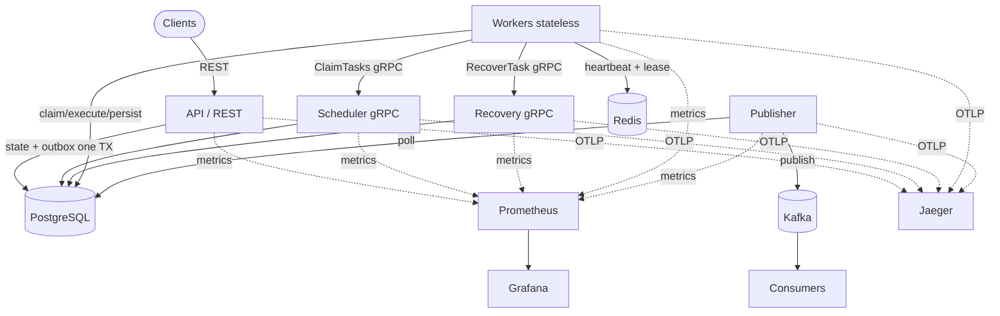
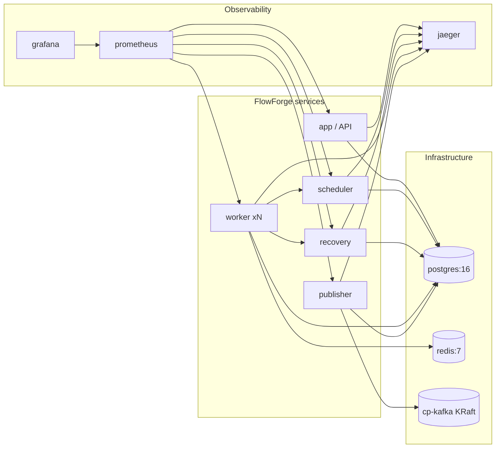

# System Diagrams

Rendered architecture diagrams. Mermaid blocks render on GitHub; ASCII fallbacks
are included for plain-text viewers.

## Overall System (Mermaid)



## Request/Data Flow (Layered)

```
        EXTERNAL                 INTERNAL (sync)            ASYNC
  ┌──────────────────┐     ┌──────────────────────┐   ┌─────────────┐
  │  Clients (REST)  │     │  Scheduler / Recovery │   │   Consumers │
  └────────┬─────────┘     │      (gRPC)           │   └──────▲──────┘
           │               └──────────┬────────────┘          │
           ▼                          │                        │
  ┌──────────────────┐               │                 ┌──────┴──────┐
  │   API (:8080)    │               │                 │   Kafka     │
  └────────┬─────────┘               │                 └──────▲──────┘
           │ TX (state+outbox)       │ claim/recover          │ publish
           ▼                          ▼                        │
  ┌───────────────────────────────────────────┐        ┌──────┴──────┐
  │            PostgreSQL (truth)              │◄───────│  Publisher  │
  └───────────────────────────────────────────┘  poll  └─────────────┘
           ▲                          ▲
   leases/ │                          │ claim/execute/persist
 heartbeat │                   ┌──────┴──────┐
     ┌─────┴─────┐             │   Workers   │
     │   Redis   │◄────────────┤ (stateless) │
     └───────────┘             └─────────────┘
```

## Deployment Topology (Docker Compose)



## Component Ownership

```
┌─────────────┬──────────────────────────────────────────────┐
│  Component  │  Owns                                          │
├─────────────┼──────────────────────────────────────────────┤
│ REST API    │  External interface (create/query)            │
│ gRPC        │  Synchronous internal comms (claim/recover)    │
│ Kafka       │  Asynchronous event stream                     │
│ Redis       │  Ephemeral coordination (leases/heartbeats)    │
│ PostgreSQL  │  Durable state (source of truth)               │
│ Workers     │  Task execution (stateless)                    │
│ Publisher   │  Outbox → Kafka relay (no state mutation)      │
│ Scheduler   │  Claim + retry promotion (no execution)        │
│ Recovery    │  Stale reclaim (no execution)                  │
└─────────────┴──────────────────────────────────────────────┘
```
